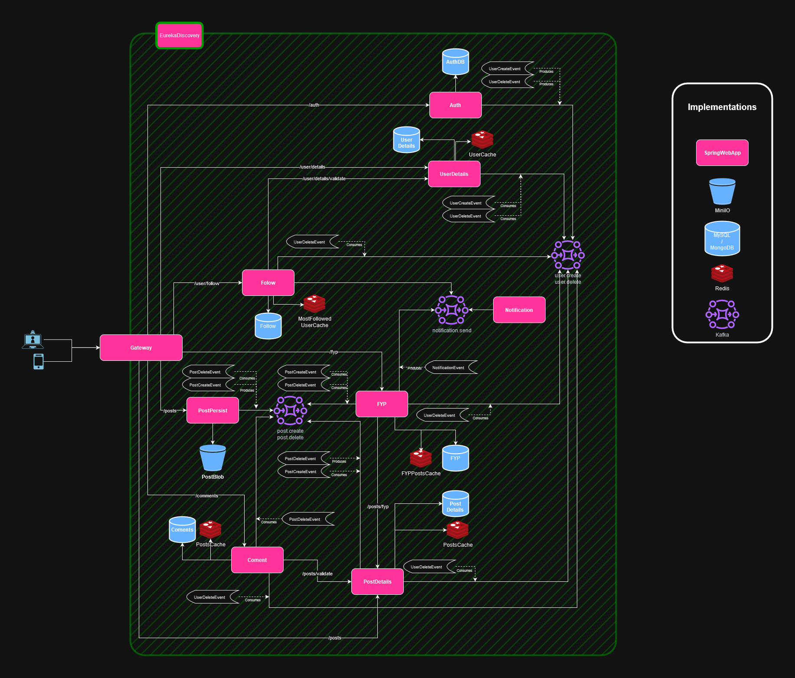

# Social Network Backend

## A platform centered around images, meant to be simple and straightforward.

### 🚀 Main technologies used:

- **Language:** Java  
- **Framework:** Spring Boot  
- **Communication:** REST / Kafka  
- **Service Discovery:** Eureka  
- **Databases & Storage:** MySQL / MinIO / Redis  
- **Containers:** Docker / Docker Compose  

---

## 🧪 System Diagram:



---

## 🧪 Microservices

| Service         | Address                                  | Description                                                                 |
|-----------------|------------------------------------------|-----------------------------------------------------------------------------|
| `discovery`     | `http://localhost:8083/eureka`           | Handles service discovery and load balancing between microservice instances |
| `auth`          | `//AUTH/**`                              | Handles authentication and JWT generation/validation                        |
| `user-details`  | `//USER-DETAILS/**`                      | Manages user metadata                                                       |
| `post-persist`  | `//POST-PERSIST/**`                      | Stores and retrieves post blobs from bucket storage                         |
| `post-details`  | `//POST-DETAILS/**`                      | Manages post metadata                                                       |
| `notification`  | `//NOTIFICATION/**`                      | Sends notifications to users                                                |
| `gateway`       | `http://<IP>:8080/api/v<VERSION>/**`     | Entry point to the platform; also handles authorization                     |

---

## ⚙️ Instalation and execution

### Prerequisits

- Docker & Docker Compose

### Clonar y levantar servicios

```bash

```


## 📌 Variables de Entorno

Cada servicio necesita su propio archivo `.env`. (Estructura detallada para cada uno en su README correspondiente):

**`.env` de `auth-service`:**

```env

```

---

## 🧪 Tests

```bash
# Ejecutar pruebas unitarias de un servicio
cd services/user-service
npm test
```

---

## 🛠️ Endpoints de Ejemplo

```http
POST /auth/login
GET  /users/:id
POST /orders
```

Documentación completa en Swagger: [http://localhost:8001/docs](http://localhost:8001/docs)

---

## 📡 Comunicación entre Servicios

| Origen          | Destino           | Medio     |
|----------------|-------------------|-----------|
| auth-service   | user-service      | HTTP REST |
| order-service  | notification-svc  | RabbitMQ  |

---

## 📄 Licencia

MIT / Apache 2.0 / GPL-3.0 — según lo que uses.
